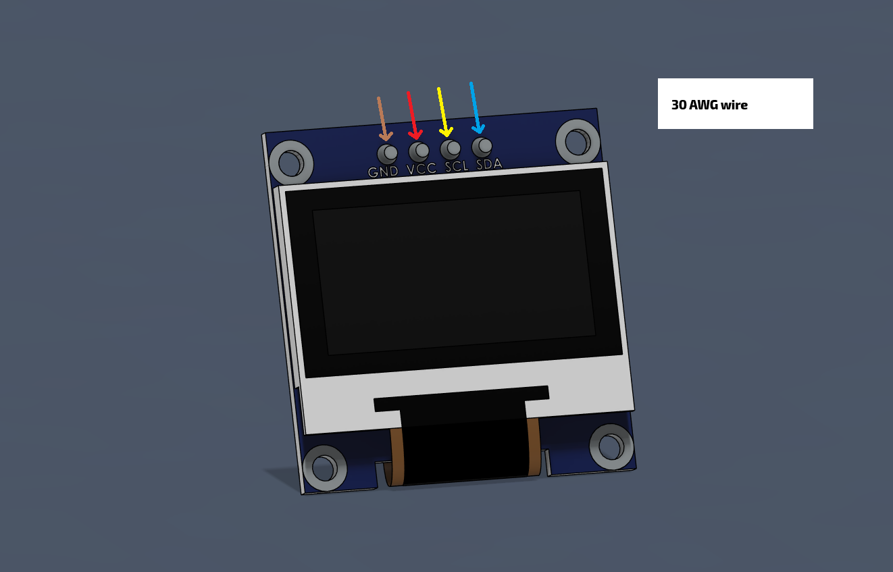
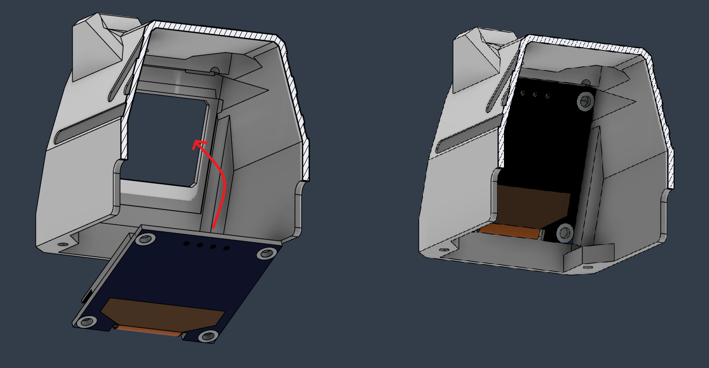
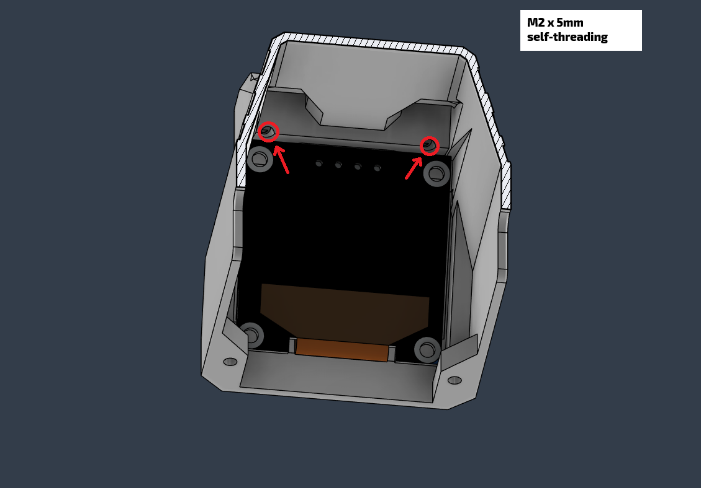
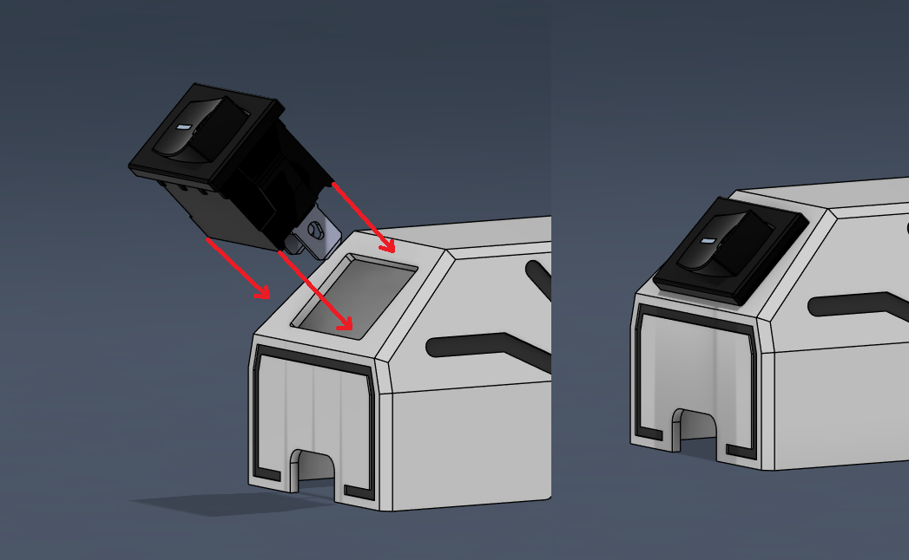
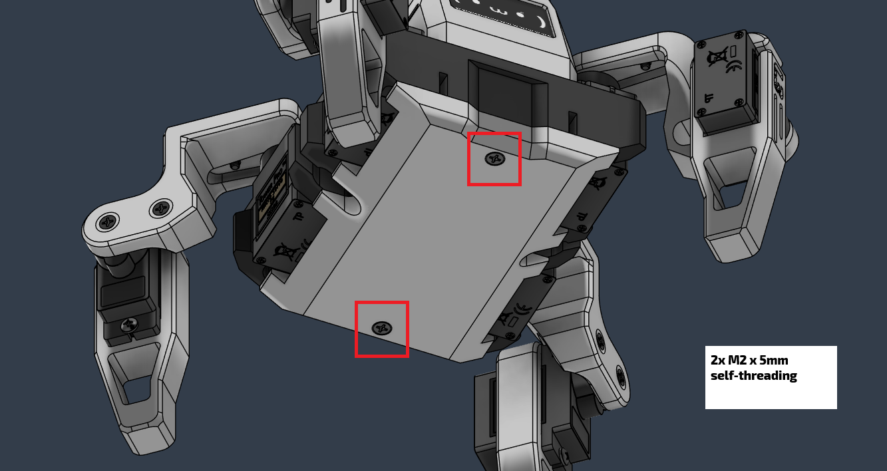

# Build Guide
Complete build guide for the Sesame Robot.

Use this walkthrough alongside the BOM, wiring guide, and printing notes to stay organized. The table below previews each phase, its goal, and the doc to reference if you get stuck.

| Phase | Goal | Est. Time | Key References |
| --- | --- | --- | --- |
| 1. Gather parts | Print plastics and source electronics | 1–2 sessions | [hardware/bom](../../hardware/bom/README.md), [hardware/printing](../../hardware/printing/README.md) |
| 2. Electronics & wiring | Build ~90% of the harness | 1 session | [docs/wiring-guide](../wiring-guide/README.md) |
| 3. Hardware pre-assembly | Prep joints, feet, top cover | 1 session | This guide (Phase 3) |
| 4. Hardware main assembly | Mount motors + electronics | 1–2 sessions | This guide (Phase 4) |
| 5. Calibrate & finish | Flash tester, align joints, close up | 1 session | Firmware README + remaining sections |

> [!TIP]
> Treat each phase like a milestone. Snap progress photos and mark issues before moving on so troubleshooting later is painless.

## Phase 1: Gathering all the parts.

**Goal:** Print the full shell set and collect every electronic, connector, and fastener before any soldering starts.

**You’ll need:**
- [hardware/bom](../../hardware/bom/README.md) for electronics, power gear, and Amazon search links.
- [hardware/printing](../../hardware/printing/README.md) for STL names, orientations, and support notes.

There are 11 printed parts (internal frame, top/bottom covers, joints R1–R4/L1–L4) plus 6–8 main electronic components depending on the wiring approach.

Here's what a complete set looks like:

**Phase 1 checklist**
- [ ] All plastic parts printed, and cleaned up.
- [ ] MG90 servos tested quickly on a servo tester or Arduino to catch DOA units.
- [ ] Power plan decided (USB-C PD vs. battery + buck) and matching connectors sourced (2× 10440 Li-ion cells in a 2× AAA holder fit the stock battery cavity).
- [ ] Consumables stocked: solder, flux, heat-shrink, zip ties, M2 hardware.

## Phase 2: Electronics and Wiring

**Goal:** Build 90% of the harness on the bench so the frame install is quick.

1. Open the [wiring guide](../wiring-guide/README.md) and pick the section that matches your build (S2 Mini hand-wired or Sesame Distro Board).
2. Lay out every connector in the order shown on the wiring diagram before soldering; this keeps the data lines from getting crossed.
3. Tin and solder the rails/buck converter first, then route signal wires. Leave generous length for the motors that terminate near the hips.
4. This is optional but you can also label each servo lead (M0–M7) using tape flags as soon as it is soldered. Future you will thank you.

> [!WARNING]
> Stop before permanently wiring the power switch or OLED. Those final joints happen after the electronics are seated in the frame so you can dial the cable length exactly.

**Phase 2 checklist**
- [ ] Harness built per your wiring diagram with all joints strain-relieved.
- [ ] Buck converter trimmed to 5.1 V output and shrink-wrapped.
- [ ] Servo leads labeled and loosely bundled by destination.
- [ ] Power switch and OLED leads pre-cut but still un-soldered.

## Phase 3: Hardware Pre-Assembly

### Femur Joints

**Goal:** Pre-load the four femur shells (R1, R2, L1, L2) with servo horns so installation is tool-free later.

1. Lay out the four femur parts and make sure the embossed labels stay readable after sanding.
2. Press-fit a single-sided servo horn into each slot. Trim flash or lightly sand the slot if the horn binds.
3. While holding the horn flat, drive an M2 × 4 mm self-threading screw through the horn and into the plastic until snug.

> [!TIP]
> Stop as soon as the horn no longer wiggles. Over-tightening will strip the plastic threads and loosen the fit.

Repeat for all four femur joints:

> [!IMPORTANT]
> Do **not** mount these joints on the servos yet. Calibration requires every motor shaft to spin freely.

### Foot Joints

Slide each foot shell over its dedicated motor before the frame install. Use the built-in gap to route wires without pinching them.

- Start by feeding the motor wires through the side slot.
- Push the shell until it momentarily flexes and snaps past the wire bundle.
- Confirm the motor sits flush and the wires exit straight out the back.

Repeat for the remaining feet so every motor already has its foot once calibration is done.

### Top Cover

The final pre-assembly step is loading the OLED and power switch into the top cover so the shell is ready for final wiring later. Since there are two main styles of top cover (Enclosed and Original) I will go over both.

#### Original Top Cover:

1. Slide the OLED display into the front slot until the bezel sits flush.

2. If the fit is loose, drive two M2 × 4 mm screws through the angled bosses to clamp the PCB.

#### Enclosed Top Cover:

1. Wire the data, power, and ground wires to the OLED display. 

1. Push the OLED display into the front slot through the inside of the top cover.

2. If the fit is loose, drive two M2 × 4 mm screws through the angled holes in the ears to clamp the PCB. You can also use a drop of removable hot glue to keep it in place.

#### Both:

3. Remove the factory pin header as it interferes with clearance. Either heat all four pins at once and pull, or clip them flush with snips.

4. Flip the cover and press-fit the rocker switch into the square cutout. Trim extra plastic on the switch housing if it refuses to seat. 

> [!NOTE]
> You can bend the rocker switch leads flat to make it fit better with the wires inside the top cover.

 
**Phase 3 checklist**
- [ ] Femur joints pre-loaded with servo horns, not yet attached to motors.
- [ ] Foot shells installed on every motor.
- [ ] OLED and rocker switch pressed into the top cover (wires untinned).

## Phase 4: Hardware Main Assembly

**Goal:** Seat the frame motors, route wiring, and secure the electronics stack so the robot is ready for calibration.

1. Dry-fit each MG90 (with foot attached) into its slot to make sure the wires naturally point toward the center.
2. Use the rotate-in technique: push the motor in horizontally, then pivot upright once the body clears the lip.

While pushing the motor in horizontally, take care to ensure the wires for the motor end up in their guide slot.

Once in, rotate the motor upwards, making sure the wires are not colliding with the internal frame. 

Repeat for all four motors. Make sure the motor shafts are closest to the outer edge of the frame and mirror side-to-side. Secure each motor with M2 × 4 mm self-threading screws.

### Wire Routing

Route each motor lead through the recessed channels molded into the internal frame. A flat-head screwdriver or spudger helps press the wires fully into the grooves.

- Keep data lines tucked along the side walls so the electronics harness can drop into the middle later.
- Add a zip tie where the bundles exit the frame to prevent them from springing back out.
- Leave the bottom cover off for now so you can tug on individual wires during calibration if needed.

## Installing the Main Electronics

Before dropping hardware in, trim or bundle any stray wires so nothing can flop into the servo gears and double-check that every connection exits upward.

1. Pre-route any long wires upward so they naturally hug the future top cover.
2. Lower the electronics harness into the cavity while keeping the USB port toward the rear.
3. **S2 Mini build:** Screw the controller (and optional protoboard) directly into the frame using the provided mounting holes. If you built a small protoboard backplane, use the spare holes in the internal frame to secure it so the servo plugs are easy to reach later.

4. **Distro board build:** Install four M2.5 × 5 mm male-female standoffs to raise the Sesame Distro Board so it clears the ESP32 DevKit. Then secure the assembly using the top screws.

> [!TIP]
> Notch = front. USB port = back. Use these two cues any time the orientation feels ambiguous.

## Calibrating & Running the Testing Firmware

**Goal:** Teach the controller where each motor sits so the walking poses land correctly.

1. Inspect the harness to ensure no bare conductors can short during testing. Add heat-shrink or tape where needed, especially near the OLED and buck converter pads.
2. Connect a reliable USB-C cable and flash `sesame-motor-tester.ino` using Arduino IDE. If you have never flashed an ESP32 before, pause here and follow a quick tutorial so you are comfortable resetting/entering boot mode.
3. Open the serial monitor; you should see the tester menu. The robot should still look like a pile of parts. None of the motors should be plugged into horns or even into the board yet.

> [!CAUTION]
> Never run calibration with joints attached. A misaligned horn can stall or strip a servo instantly.

4. Command all motors to 90°. Starting from Motor 0, plug its connector into the appropriate header (topmost plug on the distro board). If you built the hand-wired perfboard, this will be whichever socket you designated as M0. Double-check the labeling you added earlier. The servo should immediately whirr into the 90° position.
5. Repeat for Motors 1–7, following the [angle guide](assets/sesame-angle-guide.png) while viewing the robot from the back so left/right do not get flipped. Take your time; swapping two plugs is the #1 cause of calibration failiures.

6. With all motors powered at 90°, press the femur joints onto their matching shafts (text emboss up) and mimic the reference stance.

7. Run through each motor’s reference angles (center, min, max) from the serial CLI and confirm they move freely without collisions. Do **not** install the servo screws yet; you want the option to pop a horn off if a motor behaves strangely.

Common fixes (translated from the questions I get most often):

- **Setting Motor 0/1/2/3 to a maximum angle causes a crash.** Double-check that each motor’s data wire goes to the correct header. The hips sit close together and it’s easy to reverse two plugs when the harness is loose.
- **Setting Motor 4/5/6/7 straight down (0°/180°) makes the motor drive into the bottom cover.** Pull the horn off, command the opposite extreme (for Motors 4 & 6 use 180°, for 5 & 7 use 0°), then reinstall the horn pointing straight up. Run 90° again to recenter before retrying the straight-down move.
- **A motor refuses to move at all.** Confirm the servo is actually powered by gently touching it. An unpowered servo will feel loose. If loose, inspect the 3-pin plug for reversed polarity.

Finish by driving the provided servo screw (or an M2 machine screw if you need extra length) into each horn once every joint passes the min/center/max tests.

## Top Cover and Final Wiring

1. Rest the top cover on the hip joints, display facing forward. Make sure the robot is unpowered before touching the iron to anything.
2. Trim OLED and power-switch leads to length, then solder them while the cover is propped in place so you can fine-tune cable slack without stressing the pads.

3. Spend a few minutes bundling the excess wire with zip ties or heat-shrink. Route everything toward the rear corners so the cover can close. “Jam it and hope” almost always ends with a pinched wire and a dead ESP32 (ask me how I know).

> [!TIP]
> If the cover refuses to seat, remove it and relocate the densest bundle rather than forcing it. Compressed wires can short against the pin headers.

4. Press the cover down until it sits flush with the internal frame.

5. While holding the cover, insert four M2 × 10 mm self-threading screws from the underside and snug them just enough to hold the shell.

6. Drop the battery into the cavity (if using one) before closing the bottom panel. A 2× AAA holder with 10440 Li-ion cells fits the stock slot cleanly; remove the cells to recharge. Unique battery shapes can be accommodated. See [hardware/README.md](../../hardware/README.md) for CAD tips. Tethered-only builds can skip the pack.

## Bottom Cover

1. Tuck any remaining outer-motor leads through the front/back slots so they lie flat.
2. Set the bottom cover in place, checking that no wires are trapped along the edges.

3. Secure the plate with two M2 × 5 mm self-threading screws.

**Phase 4 checklist**
- [ ] Motors mounted and screws snug.
- [ ] Harness routed with no pinch points; electronics stack secured.
- [ ] Top and bottom covers installed, but easy to remove again if calibration needs a revisit.

## Final Checks and Flashing the Firmware

Great job! The hardware is complete, now we just need to do a few checks to make sure everything is working and we can flash the firmware onto the microcontroller.

**Sanity checks**
1. Toggle the power switch (if you installed a battery) and confirm it fully disconnects the pack.
2. Confirm the USB-C port is accessible for future firmware updates.
3. Inspect the OLED wiring one last time to ensure SDA/SCL aren’t swapped.

**Flash production firmware**
1. Choose the code variant (S2 Mini or Distro Board) from the firmware folder. Customize pin definitions if you’re using a different ESP32.
2. Use Arduino IDE to flash the full firmware bundle (motors + faces). Detailed notes live in [firmware/README.md](../../firmware/README.md).
3. Connect to Sesame’s Wi-Fi AP, load the control page, and trigger a pose to verify everything moves as expected.

That’s it. You’ve built Sesame! From here you can design new poses in [Sesame Studio](../../software/sesame-studio/README.md) or tweak the hardware per [hardware/README.md](../../hardware/README.md), or whatever you want!